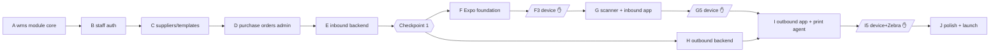

# Warehouse Scanning System — Plan v3 (Expo rebuild)

Status: **approved for execution** · Replaces plan v2 (rejected 2026-07) and the deleted v1 plan.
Spec: `docs/specs/warehouse-scanning-system.md` (approved v2, 2026-07-12 — architecture unchanged; commit it to the repo before implementation starts so worker briefs can link it).
Task list: `tasks/todo.md` (v3 — the single source of truth for what to build; every task block is self-contained).

## What changed from v2

- Every task rewritten to be readable by a worker with **zero conversation history** — no references to v1/v2 task numbers or deleted code.
- The three former XL bundles split: old B2 → B1+B2, old B5 → E1+E2+E3, old O1–O6 → H1–H7 + I1–I3. All 30 tasks are now S/M (1–5 files each).
- Execution model made explicit (below): Fable 5 brain + Sonnet 5 workers, gates + when-stuck consultation.
- **Shiprocket ownership revised (user decision, 2026-07-11, supersedes the spec's "wms module owns Shiprocket"):** everything goes through the already-installed `@sam-ael/medusa-plugin-shiprocket` — its fulfillment provider, client, tracking module, and webhooks. wms adds only a thin adapter (H1). Consequence: the Medusa fulfillment is created at **order placement** (that's when the plugin creates the Shiprocket order + AWB + label, so the label can print before picking); pack completion marks the order shipped. Update the spec section accordingly.

## Execution model

**Roles**

- **Brain (Fable 5, main implementation session):** sequences tasks, writes each worker brief, reviews every worker diff before check-off, runs milestone gates, handles all ask-first items with the user, diagnoses failures. Does not implement tasks itself except when unblocking (see stuck rule).
- **Workers (Sonnet 5 subagents):** dispatched with the built-in Agent tool (`general-purpose`, `model: sonnet`), one task per dispatch. Brief = the **Standard worker-brief preamble** from `tasks/todo.md` + the full task block + spec-section pointers (once the spec is committed). Worker must run the task's named verification command and report actual output; a worker never checks off its own task.

**Gates (mandatory)**

1. **Milestone start:** brain re-reads the relevant spec section, confirms task order still holds, prepares briefs.
2. **Per task:** brain reviews the worker's diff + verification output before marking done. Cheap because the brain is the main session.
3. **Milestone checkpoint:** brain runs the full affected test suites itself, browser-verifies admin flows where relevant, and summarizes state to the user. Device checkpoints (F3, G5, I5) are executed physically by the user with a checklist the brain provides.

**Stuck rule:** a worker that fails its verification twice stops and reports back. The brain then either (a) re-briefs with a sharper diagnosis, or (b) fixes it directly in the main session. Never a third blind retry.

**Ask-first stays with the user** (brain asks, workers never do): new dependencies (Expo scaffold F1, print-agent I1), storefront shipping-option prod cutover, Apple Developer account, deploy-pipeline anything.

## Milestone map

Dependency order is strict within A→E (backend foundations) and F→G (app). Milestone H can start after Checkpoint 1 **in parallel** with F/G — the brain may interleave. Milestone I needs both G5 and H complete.

| Checkpoint | Who | What |
|---|---|---|
| Checkpoint 1 (after E) | brain | all backend suites green; admin flows browser-verified; report to user |
| F3 / M0d | user (device) | login on Android + iPhone via Expo Go over LAN; disabled staff bounced (spec criterion 6) |
| G5 / M1d | user (device) | full inbound on both phones; dense Code128; scan feels instant; app-kill mid-session survives; partial receive completes (spec criteria 3, 4-partial, 5-inbound) |
| I5 / M2d | user (device+hw) | spec criteria 1, 2, 5, 8 incl. real Zebra ZD230 + kill-the-Pi drill |
| J5 launch gate | user + brain | all 9 spec success criteria demonstrated; stock-take backfill run; prod shipping-option repoint to the Shiprocket plugin provider (explicit approval); prod webhook registered; existing storefront tests green; ops runbook `docs/warehouse-ops.md` |

## Risks

| Risk | Mitigation |
|---|---|
| Worker (Sonnet) drifts from repo conventions | Brief includes the standard preamble (model-style reference + boundaries); brain reviews every diff before check-off |
| Spec not yet in repo → worker briefs can't cite it | Task bodies fully self-contained; user commits `docs/specs/warehouse-scanning-system.md` before implementation |
| pnpm monorepo + Metro quirks | Expo official monorepo setup; app deps isolated in its own package.json |
| Expo Go limits | Everything in F/G (camera, haptics, secure-store, AsyncStorage) is Expo Go-compatible; EAS dev build only if a bare native module appears |
| iOS distribution blocked | Android-only launch viable; iPhone stays on Expo Go until Apple account decision |
| Shiprocket API surprises | All Shiprocket traffic goes through `@sam-ael/medusa-plugin-shiprocket` (permanent — never removed); wms wraps it behind a mocked `ShipmentCarrier` interface; live-tested only at staging checkpoint |
| Plugin API surface gaps (courier choice, label format, pickup quirks) | Surfaced at the staging checkpoint before launch; adapter (H1) is the single place to extend; escalate to the user before working around the plugin |
| Stock deducts at order placement (fulfillment created on `order.placed` so the label prints before picking — user-approved) | Order cancellation auto-cancels the fulfillment and restocks (H3); oversell risk actually decreases |
